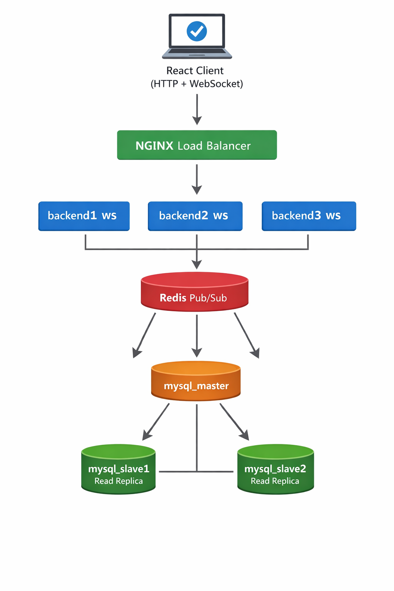
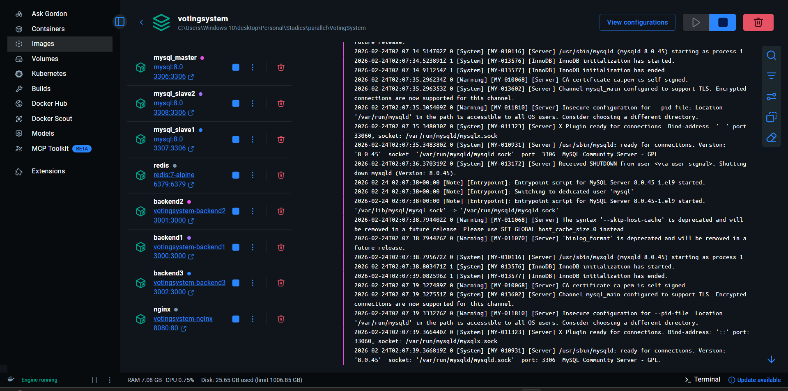
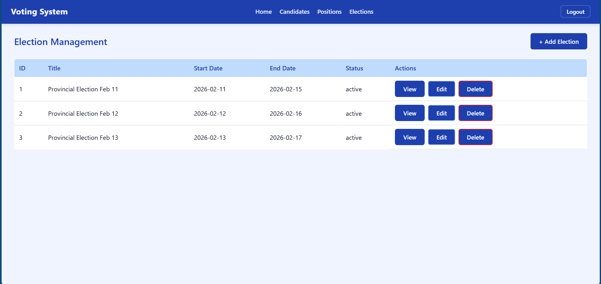
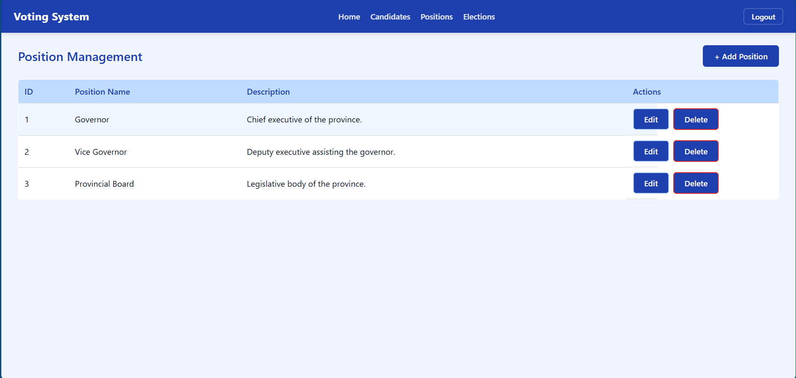
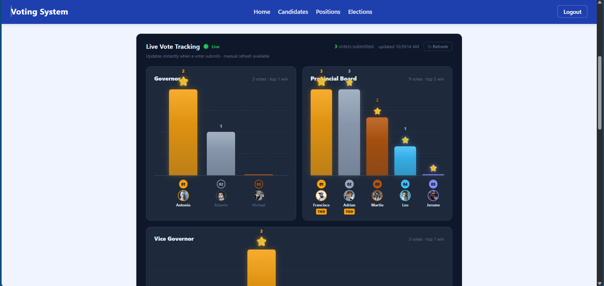
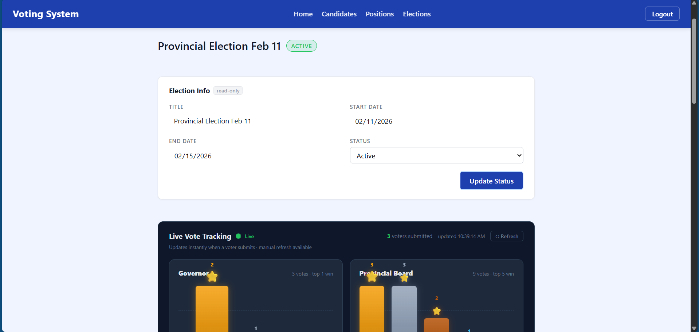
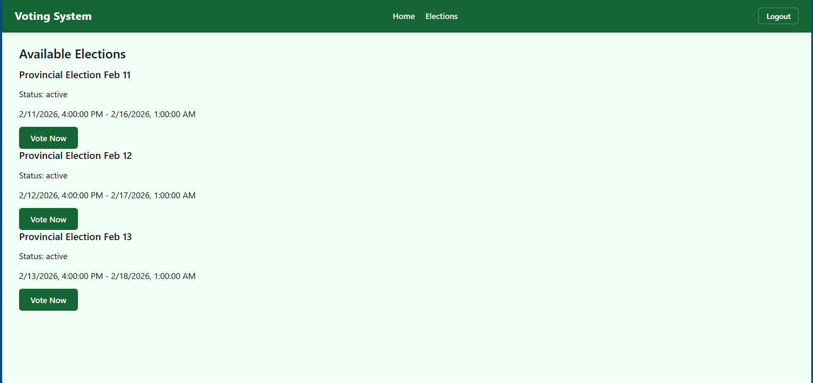
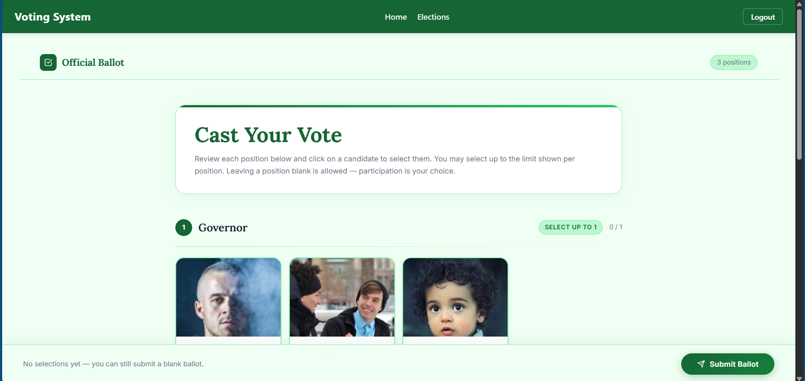
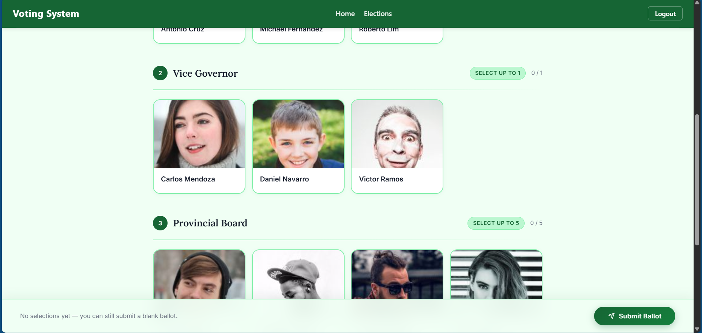

---

## Architecture Diagrams and System Interface Documentation

### System Architecture Diagram



This diagram illustrates the overall flow and distributed architecture of the voting system. Client requests are routed through a centralized load balancer to multiple backend servers. Real-time communication is coordinated using Redis, while persistent data storage is managed through a MySQL master–slave replication strategy consisting of one master database and two read replicas.

**Key Details:**

* 3 backend servers (each runs its own WebSocket server)
* Redis synchronizes events across backends for **real-time updates**
* MySQL master handles all writes, slaves handle reads for scalability

---

## Containerized Deployment Overview



Each component—including the client, backend servers, load balancer, Redis, and MySQL databases—is deployed in its own Docker container.

**Key Details:**

* Stateless backend design allows horizontal scaling
* Nginx load balancer handles both **HTTP API requests** and **WebSocket connections**
* Deployment uses Docker Compose for automated startup and initialization

---

## Setup & Deployment

### Tech Stack

| Layer | Technology |
|---|---|
| Backend | Express.js |
| Frontend | React.js (Vite) |
| WebSockets | Socket.IO |
| Load Balancer | Nginx |
| Cache / Pub-Sub | Redis (with Socket.IO Redis Adapter) |
| Database | MySQL (master–slave replication) |
| Containerization | Docker & Docker Compose |

---

### Prerequisites

Install the following before getting started:

- **Node.js** (LTS) — [https://nodejs.org/en/download](https://nodejs.org/en/download)
- **Docker Desktop** (includes Docker Compose) — [https://www.docker.com/products/docker-desktop](https://www.docker.com/products/docker-desktop)

Then install the required npm packages for each — refer to:
- **Server** — `server/requirements.md`
- **Client** — `client/requirements.md`

---

### Environment Variables

#### Server — `.env` (inside `/server` or root, depending on your structure)

Create a `.env` file and configure the following:

```env
NODE_ENV=development

# Server Ports
SERVER_PORT=3000
SERVER_PORT_2=3001
SERVER_PORT_3=3002
SERVER_HOST=localhost

# Database
DB_HOST=mysql_master
DB_PORT=3306
DB_USER=root
DB_PASS=111
DB_NAME=voting_system
DB_INIT=true

# JWT & OTP
JWT_SECRET=super_secret_key_change_this
JWT_EXPIRES_IN=1h
OTP_EXPIRY_MINUTES=5
```

#### Client — `.env` (inside `/client`)

```env
# Points to the Nginx load balancer
VITE_API_URL=http://localhost:8080
```

---

### Running the Project

**1. Clone the repository**

```bash
git clone 
cd 
```

**2. Set MySQL config file permissions**

Required for MySQL master–slave replication to initialize correctly:

```bash
chmod 644 ./master/conf/replication.cnf
chmod 644 ./slave1/conf/replication.cnf
chmod 644 ./slave2/conf/replication.cnf
```

**3. Run the build script**

```bash
chmod +x build.sh
./build.sh
```

This script will automatically:

- Stop any existing containers and clean volumes
- Build all Docker images (backend tests run during this step)
- Configure MySQL master–slave replication
- Initialize the database schema and seed data
- Start Redis, all backend instances, Nginx, and the React client

> ⚠️ If any Jest test fails during the build, deployment stops immediately. Fix the failing tests before retrying.

### Accessing the App

| Service         | URL                        |
| --------------- | -------------------------- |
| React Client    | http://localhost:5173      |
| API (via Nginx) | http://localhost:8080      |
| WebSocket       | ws://localhost:8080        |

---

## Administrative Module Interfaces

### Candidate Management Interface


Administrators can **add, edit, remove, and display candidates**.

**Key Details:**

* Operations update the database through the backend APIs
* Changes are immediately reflected in **real-time vote tracking**

---

### Election Management Interface



Administrators can **add, edit, remove, and display elections**.

**Key Details:**

* Works with associated positions and candidates
* Live updates are sent to connected clients via Redis/WebSocket

---

### Position Management Interface



Allows **management of election positions**, which organize the voting process.

**Key Details:**

* Positions are linked to elections and candidates
* Updates propagate to all active voter sessions in real time

---

### Real-Time Vote Tracking

  
  


Displays live vote rankings and counts.

**Key Details:**

* Uses WebSockets coordinated with Redis for real-time updates
* No page refresh required
* Works seamlessly across multiple backend instances

---

## Voter Module Interfaces

### Election Selection Interface



Voters can view elections and select which to participate in.

**Key Details:**

* Shows pending and active elections
* Selecting an election opens the voting page
* Real-time updates ensure accurate election status

---

### Voting Interface

  


Allows voters to cast votes per position.

**Key Details:**

* Enforces **vote limits and input validation**
* Updates are sent immediately to the live tracking interface
* Submissions are processed via backend APIs and recorded in MySQL

---

## Documentation Summary

The figures above illustrate the voting system's:

* **Distributed architecture** with multiple backend instances
* **Containerized deployment** for isolation and scalability
* **Administrative modules** for managing elections, candidates, and positions
* **Real-time vote tracking** via WebSockets + Redis
* **Voter interaction flow** with constraints and validation

This setup demonstrates **scalable, real-time, and test-gated distributed system design**, while remaining simplified for demonstration and educational purposes.

---